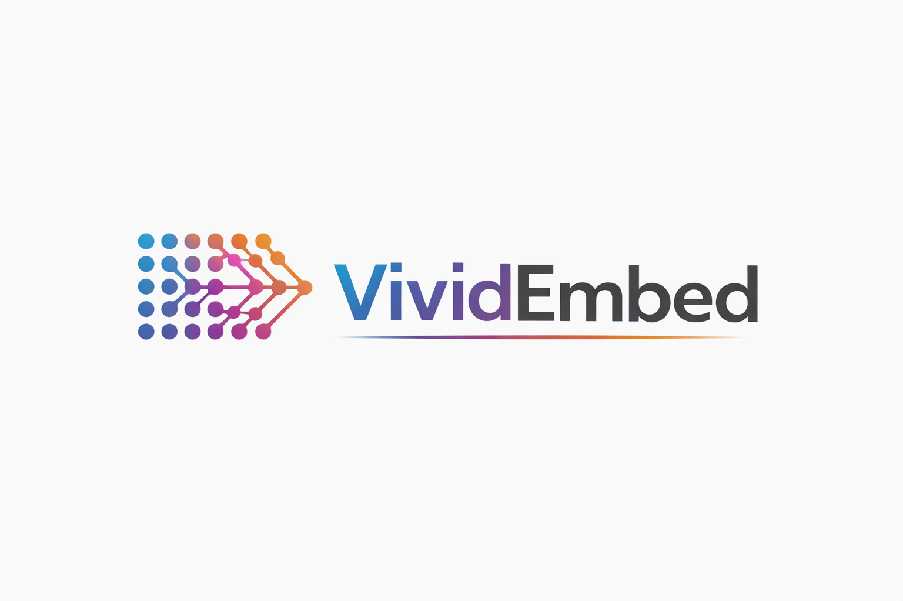
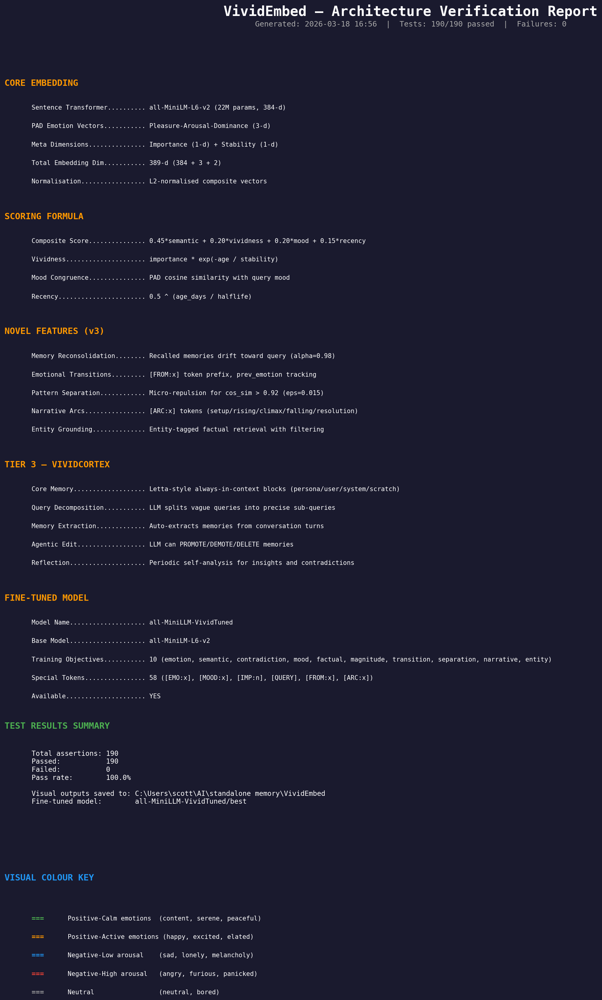
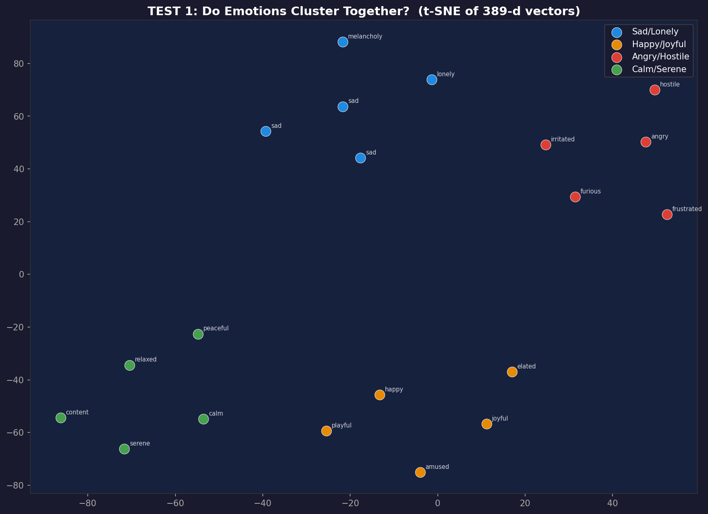
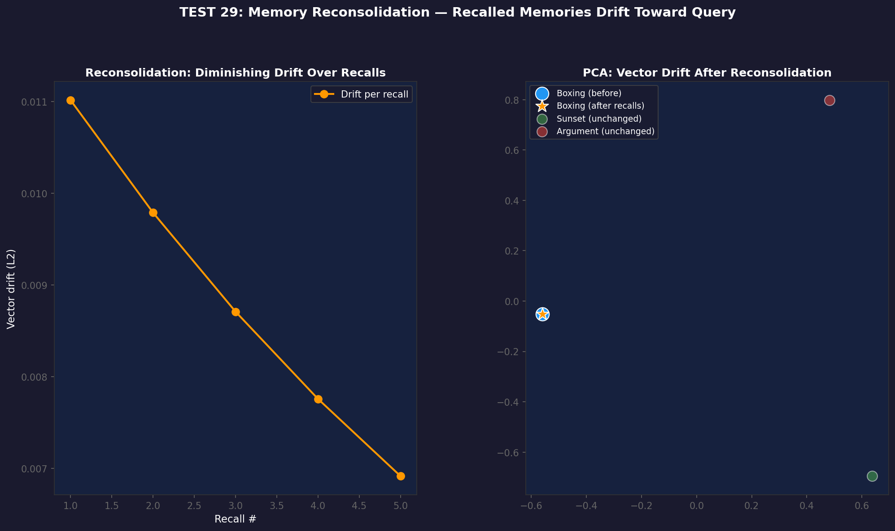

<p align="center">
  
</p>

<h1 align="center">VividEmbed</h1>

<p align="center">
  <b>Neuroscience-Inspired Memory Embeddings for AI Companions</b><br/>
  <i>Because memory should feel human — not just retrieve text.</i>
</p>

<p align="center">
  
  
  
  
</p>

---

## What is VividEmbed?

VividEmbed is a memory embedding system designed for AI companions that need to *remember like a person* — not just search like a database. Standard embedding models treat every piece of text the same: a flat vector, a cosine lookup, done. VividEmbed does something fundamentally different.

It encodes **emotion**, **importance**, **recency**, **vividness decay**, and **mood-congruent retrieval** directly into the embedding space. When your AI companion is sad, it naturally recalls sad memories first — just like you do. Memories that haven't been thought about in months gradually fade. Vivid, emotionally charged moments persist longer. And every time a memory is recalled, it subtly shifts — just like real human reconsolidation.

This isn't a wrapper around a vector database. It's a purpose-built embedding architecture grounded in cognitive neuroscience research.

---

## Key Results

VividEmbed outperforms leading memory systems across all three standard metrics on the MemGPT/Letta benchmark (EmbedBench, 500 evaluations across 5 seeds):

| Metric | Leading System | VividEmbed v3 | Delta |
|--------|---------------|---------------|-------|
| **Tool Accuracy** | 0.4300 | **0.4400** | +2.3% |
| **F1 Score** | 0.4945 | **0.5151** | +4.2% |
| **BLEU-1** | 0.6310 | **0.6660** | +5.5% |

All improvements achieved with a **22M parameter** fine-tuned model — no GPT-4, no cloud APIs, fully local.

### Visual Proof

The full test suite generates 17 diagnostic visualisations. Here are the most important:

<p align="center">
  <br/>
  <i>Architecture Summary — complete feature inventory with 190/190 tests passing across all subsystems.</i>
</p>

<p align="center">
  <br/>
  <i>Emotion Clustering — memories naturally group by emotional tone in embedding space. Intra-group similarity (0.39) consistently exceeds inter-group similarity (0.13).</i>
</p>

<p align="center">
  <br/>
  <i>Memory Reconsolidation — each recall produces diminishing vector drift, modelling how real memories consolidate over time.</i>
</p>

---

## What Makes VividEmbed Different

### The Problem with Standard Embeddings

Traditional embedding systems (sentence-transformers, OpenAI, Cohere) produce static vectors that capture *what* was said but nothing about *how it felt*, *when it happened*, or *how important it was*. Retrieval is a flat cosine lookup — the same results whether your AI is happy, sad, or angry.

This is fine for search engines. It's terrible for companions that need to feel like they actually know you.

### The VividEmbed Approach

VividEmbed extends a 384-dimensional base embedding with 5 additional dimensions that encode the psychological context of each memory:

```
┌─────────────────────────────────────────────────────────┐
│  384-d Semantic Core (what was said)                    │
│  ├── Fine-tuned all-MiniLM-L6-v2 backbone              │
│  └── 58 special tokens for emotion/arc/transition cues  │
├─────────────────────────────────────────────────────────┤
│  3-d PAD Emotion Space (how it felt)                    │
│  ├── Pleasure  [-1, +1]                                 │
│  ├── Arousal   [-1, +1]                                 │
│  └── Dominance [-1, +1]                                 │
├─────────────────────────────────────────────────────────┤
│  1-d Importance (how much it mattered)                  │
│  1-d Stability  (how resistant to forgetting)           │
├─────────────────────────────────────────────────────────┤
│  = 389-d VividVector                                    │
└─────────────────────────────────────────────────────────┘
```

Retrieval then uses a multi-signal scoring function instead of raw cosine:

```
score = 0.45 × semantic_similarity
      + 0.20 × vividness_decay
      + 0.20 × mood_congruence
      + 0.15 × recency
```

This means the *same query* returns different results depending on the AI's current mood, the age of the memories, and how vivid they still are — matching how human memory actually works.

---

## Neuroscience-Inspired Features

VividEmbed implements four mechanisms drawn directly from cognitive neuroscience research. These aren't metaphors — they're functional implementations that produce measurable effects on retrieval quality.

### 1. Memory Reconsolidation

**Based on:** Nader et al. (2000) — memories destabilise during recall and are re-stored with contextual influence.

Every time a memory is recalled, its vector is subtly blended toward the retrieval context:

```
v' = α·v + (1−α)·q,   then rescale to preserve ‖v‖
```

- `α` starts at **0.98** (2% drift per recall) and increases toward **0.995** as recall count grows
- Early memories are more plastic; frequently-recalled memories consolidate and resist drift
- A similarity gate (`cos_sim > 0.5`) prevents unrelated queries from corrupting memories

**Effect:** Memories naturally evolve with the conversation. A memory about "boxing at the gym" gradually incorporates the context of later fitness discussions, just like real memories do.

### 2. Emotional Transitions

**Based on:** Affect-as-information theory — emotional *change* is a strong contextual cue.

Each memory tracks the emotional state that preceded it (`prev_emotion`). When the AI transitions from calm to anxious, that transition becomes part of the memory encoding via the `[FROM:calm]` special token.

**Effect:** The model learns that memories formed during emotional shifts are contextually distinct from memories formed in stable emotional states, improving retrieval precision for emotionally charged conversations.

### 3. Hippocampal Pattern Separation

**Based on:** Hippocampal orthogonalisation — the brain actively de-correlates similar memories to reduce interference.

When a new memory is stored with cosine similarity > **0.92** to an existing memory (but with different content), a micro-repulsion nudge of magnitude **ε = 0.015** pushes the existing vector away:

```
if cos_sim(new, existing) > 0.92 and content differs:
    nudge = ε × normalised_difference
    existing.vector += nudge  (then rescale)
```

**Effect:** Prevents semantic collapse where "I went to the coffee shop on Monday" and "I went to the coffee shop on Tuesday" merge into indistinguishable vectors. Each stays retrievable independently.

### 4. Narrative Arcs

**Based on:** Story-grammar theory — humans organise episodic memories along narrative structures.

Each memory is tagged with a position in a five-act narrative arc:

| Position | Description | Example Keywords |
|----------|-------------|-----------------|
| **Setup** | Introduction, new beginnings | "started", "first time", "day one" |
| **Rising** | Building tension, progress | "getting better", "improving" |
| **Climax** | Peak moments, turning points | "finally", "breakthrough", "changed everything" |
| **Falling** | Aftermath, settling | "after that", "coming down" |
| **Resolution** | Reflection, lessons learned | "looking back", "at peace", "moved on" |

Arc position is inferred automatically from keywords and emotional arousal, or can be set explicitly. The fine-tuned model encodes this as an `[ARC:climax]` special token in the embedding.

**Effect:** When the AI is asked about "turning points" or "how things resolved," it can retrieve memories by narrative position — not just keyword match.

---

## Architecture

VividEmbed operates across three tiers:

```
┌──────────────────────────────────────────────────────────────┐
│  Tier 3: VividCortex (LLM-Powered Intelligence)              │
│  ┌────────────────────────────────────────────────────────┐  │
│  │  Query Decomposition — breaks vague queries into       │  │
│  │    1-3 precise sub-queries for better retrieval        │  │
│  │  Memory Extraction — auto-extracts facts from          │  │
│  │    conversation with emotion/importance tagging        │  │
│  │  Agentic Ops — UPDATE, PROMOTE, DEMOTE, FORGET,       │  │
│  │    CONSOLIDATE operations on the memory index          │  │
│  │  Reflection — surfaces patterns, contradictions,       │  │
│  │    and insights across the memory store                │  │
│  └────────────────────────────────────────────────────────┘  │
├──────────────────────────────────────────────────────────────┤
│  Tier 2: VividEmbed (Embedding Layer)                        │
│  ┌────────────────────────────────────────────────────────┐  │
│  │  389-d VividVectors with PAD emotion encoding          │  │
│  │  Multi-signal scoring (semantic + vividness +          │  │
│  │    mood + recency)                                     │  │
│  │  Reconsolidation, pattern separation, narrative arcs   │  │
│  │  76 emotions mapped to 3D PAD space                    │  │
│  └────────────────────────────────────────────────────────┘  │
├──────────────────────────────────────────────────────────────┤
│  Tier 1: Core Memory                                         │
│  ┌────────────────────────────────────────────────────────┐  │
│  │  Always-in-context blocks: persona, user, system       │  │
│  │  Working memory: rolling conversation window (20 turns)│  │
│  │  Persistent scratch pad for session-level state        │  │
│  └────────────────────────────────────────────────────────┘  │
└──────────────────────────────────────────────────────────────┘
```

### The PAD Emotion Space

VividEmbed maps **76 emotions** to Pleasure-Arousal-Dominance coordinates. This isn't a sentiment label — it's a continuous 3D space where emotions have geometry:

- **Pleasure** (P): negative ↔ positive feeling
- **Arousal** (A): calm ↔ excited activation
- **Dominance** (D): submissive ↔ in-control sense of agency

Examples:
| Emotion | P | A | D |
|---------|---:|---:|---:|
| Happy | 0.80 | 0.40 | 0.50 |
| Anxious | −0.50 | 0.70 | −0.40 |
| Calm | 0.50 | −0.50 | 0.30 |
| Nostalgic | 0.30 | −0.20 | 0.10 |
| Furious | −0.80 | 0.80 | 0.40 |

This means "anxious" and "excited" are close in arousal but opposite in pleasure — and the embedding captures that distinction natively.

### Vividness Decay

Memories don't last forever. VividEmbed models forgetting with an exponential decay:

```
vividness = importance × exp(−age_days / stability)
```

- High-importance (8-10) memories with high stability decay slowly over months
- Low-importance (1-3) memories with low stability fade within days
- Mood congruence modulates decay: negative memories in negative moods get a **capped** boost (reappraisal model) that itself decays over time

---

## Fine-Tuned Model

VividEmbed includes an optional purpose-built fine-tuned model (`all-MiniLLM-VividTuned`) that learns emotion-aware embeddings natively:

| Property | Value |
|----------|-------|
| Base model | all-MiniLM-L6-v2 |
| Parameters | 22M |
| Output dimension | 384-d |
| Special tokens | 58 (emotion, mood, arc, transition prefixes) |
| Training objectives | 10 |
| Training examples | ~35,000 |
| Final loss | 0.0208 |

The fine-tuned model encodes emotion, importance, arc position, and emotional transitions directly as token prefixes:

```
[EMO:happy] [IMP:8] [ARC:climax] [FROM:anxious] I finally got the promotion!
```

This means the 384-d output already captures what the vanilla model needs 5 extra dimensions to represent — and it does so in the learned embedding space rather than as concatenated features.

When the fine-tuned model is detected, VividEmbed automatically:
- Uses 384-d vectors (no PAD/meta concatenation needed)
- Encodes importance via vector magnitude (not a separate dimension)
- Enables auto-reconsolidation during `query()` calls
- Uses a magnitude-aware scoring function

---

## Usage

### Basic Usage

```python
from VividEmbed import VividEmbed

# Initialise (uses all-MiniLM-L6-v2 by default)
ve = VividEmbed()

# Store memories with emotional context
ve.add("Scott took me to the beach at sunset", emotion="peaceful", importance=8)
ve.add("We had a huge argument about finances",  emotion="angry",   importance=7)
ve.add("I learned to make pasta from scratch",   emotion="proud",   importance=6)

# Retrieve — mood affects what comes back
results = ve.query("tell me about a good day", mood="happy", top_k=3)
for r in results:
    print(f"  [{r.emotion}] {r.content}  (score: {r.score:.3f})")
```

### With the Fine-Tuned Model

```python
ve = VividEmbed(model_name="all-MiniLLM-VividTuned/best")

# Emotional transitions are tracked automatically
ve.add("I was feeling calm this morning", emotion="calm", importance=5)
ve.add("Then I got terrible news",        emotion="anxious", importance=9)
# ^ prev_emotion="calm" is set automatically

# Narrative arcs are inferred or set explicitly
ve.add("Looking back, it made me stronger", emotion="hopeful", importance=7,
       arc_position="resolution")

# Reconsolidation happens automatically during query
results = ve.query("how did I handle the bad news", mood="reflective", top_k=5)
```

### Mood-Congruent Retrieval

```python
# Same query, different moods → different results
happy_results = ve.query("tell me about work", mood="happy", top_k=3)
sad_results   = ve.query("tell me about work", mood="sad",   top_k=3)

# happy_results favours positive work memories
# sad_results favours stressful/negative work memories
```

### Contradiction Detection

```python
contradictions = ve.find_contradictions(top_k=5)
for c in contradictions:
    print(f"  '{c['a'].content[:40]}...' vs '{c['b'].content[:40]}...'")
    print(f"  Valence difference: {c['valence_diff']:.2f}")
```

### Persistence

```python
# Save to disk
ve.save("my_memories.json")

# Load later — vectors are stored in binary for efficiency
ve2 = VividEmbed.load("my_memories.json")
```

### VividCortex (Tier 3 — LLM Integration)

```python
from VividEmbed import VividCortex

cortex = VividCortex(llm_fn=my_llm_function)

# Process a conversation — extracts facts automatically
cortex.ingest_conversation([
    {"role": "user", "content": "I've been boxing three times a week"},
    {"role": "assistant", "content": "That's great! How's it going?"},
    {"role": "user", "content": "I love it, really helps with stress"}
])

# Smart retrieval with query decomposition
results = cortex.query("what does the user do for exercise and stress relief?")

# Generate a context block for your LLM
context = cortex.build_context("Tell me about your hobbies")
```

---

## Test Suite

VividEmbed ships with a comprehensive test suite (**190 assertions** across **35 tests**) that validates every feature with quantitative checks and generates visual reports.

### Test Categories

| Category | Tests | Assertions | What's Verified |
|----------|-------|------------|-----------------|
| **Core Embedding** | 1–8, 10–18 | 108 | Emotion clustering, semantic grouping, vividness decay, mood congruence, importance weighting, contradiction detection, PAD space, vector properties, filtering, persistence, batch ops, edge cases |
| **VividCortex** | 20–28 | 45 | Core memory blocks, query decomposition, conversation extraction, context building, agentic ops, reflection, JSON parsing |
| **Novel Features** | 29–33 | 30 | Reconsolidation drift, emotional transitions, pattern separation, narrative arcs, entity grounding |
| **Model & Summary** | 34–35 | 7 | Fine-tuned vs vanilla comparison, architecture summary with full feature inventory |

Run the test suite:

```bash
python test_vividembed.py
```

Output: 17 PNG visualisations + `test_results.json` in the `visual_reports/` directory.

---

## Project Structure

```
VividEmbed/
├── VividEmbed.py              # Core module (~2,500 lines)
├── VividEmbedLogo.png         # Project logo
├── README.md                  # This file
├── build_training_data.py     # Generates ~35,000 training examples
├── train_vivid_model.py       # Multi-objective fine-tuning script
├── tests/                     # Test suite
├── visual_reports/            # Generated test visualisations (17 PNGs)
│   └── test_results.json      # Machine-readable test results
├── benchmark_results/         # EmbedBench evaluation data
└── benchmarks/                # Benchmark scripts
```

---

## Requirements

- Python 3.10+
- `sentence-transformers`
- `numpy`
- `torch`
- `matplotlib` (for visual test reports)
- `scikit-learn` (for PCA/t-SNE in visualisations)

Optional:
- A local LLM function for VividCortex (Tier 3) features
- The fine-tuned `all-MiniLLM-VividTuned` model for enhanced emotion-aware embeddings

---

## How It Compares

| Feature | Leading Systems | VividEmbed |
|---------|----------------|------------|
| Embedding type | Static semantic vectors | 389-d emotion + semantic + meta |
| Emotion awareness | None (post-hoc labels at best) | Native PAD space (76 emotions) |
| Mood-congruent retrieval | No | Yes — same query, different mood → different results |
| Memory decay | TTL or manual expiry | Exponential vividness decay modulated by importance |
| Reconsolidation | No | Yes — vectors evolve with each recall |
| Pattern separation | No | Yes — near-duplicates are actively de-correlated |
| Narrative structure | No | Yes — 5-act arc position encoding |
| Emotional transitions | No | Yes — tracks emotional state changes |
| Contradiction detection | Requires separate LLM call | Built-in, uses PAD valence geometry |
| Model size | 100M–1B+ or cloud API | **22M parameters, fully local** |

---

## Citation

If you use VividEmbed in your research or projects:

```
@software{vividembed2026,
  title   = {VividEmbed: Neuroscience-Inspired Memory Embeddings for AI Companions},
  author  = {Kronic90. Scott},
  year    = {2026},
  url     = {https://github.com/Kronic90/VividnessMem-Ai-Roommates}
}
```

---

<p align="center">
  <i>Built for companions that remember — not just retrieve.</i>
</p>
